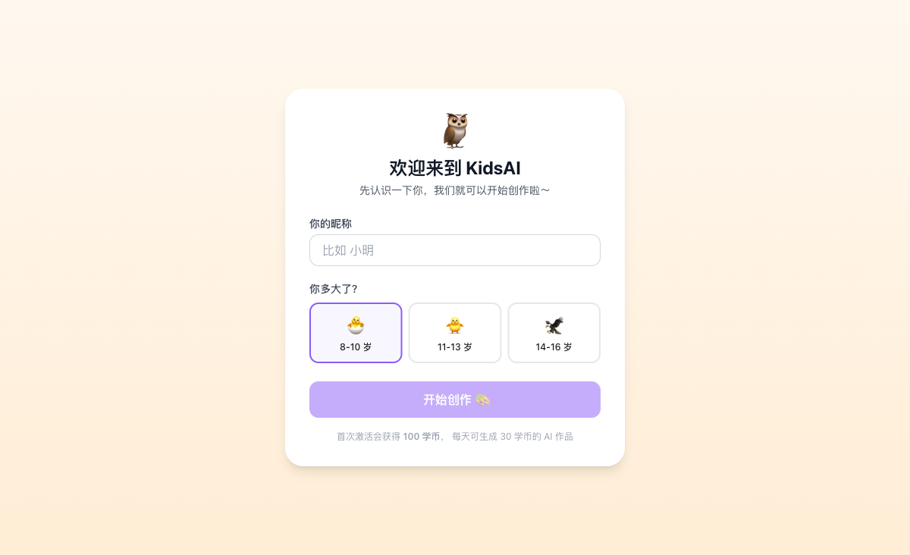
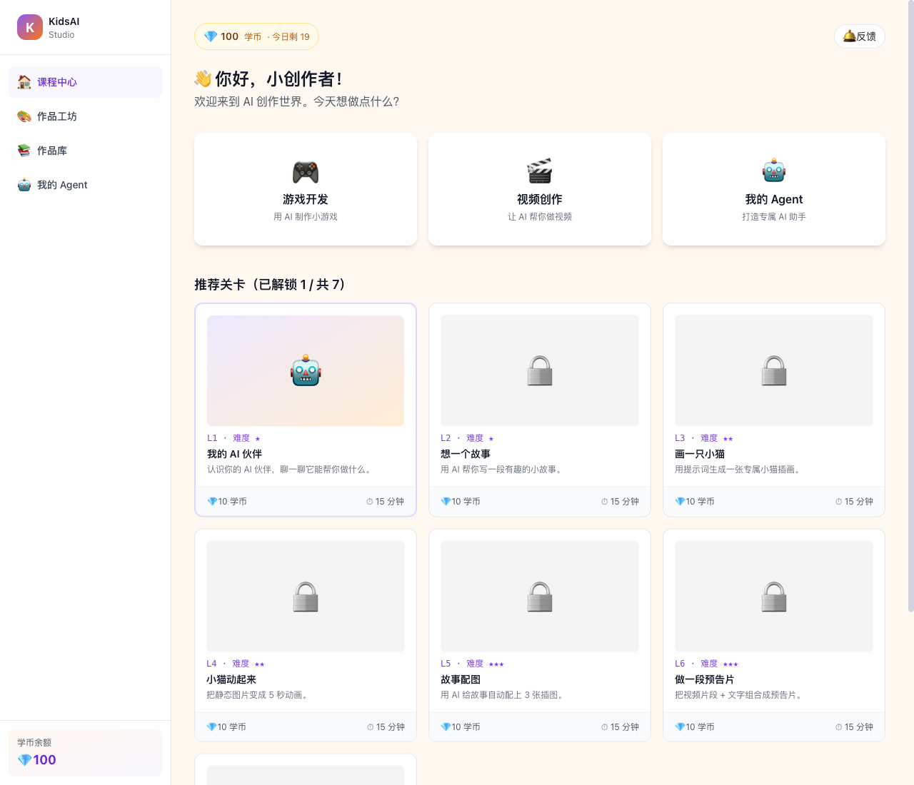
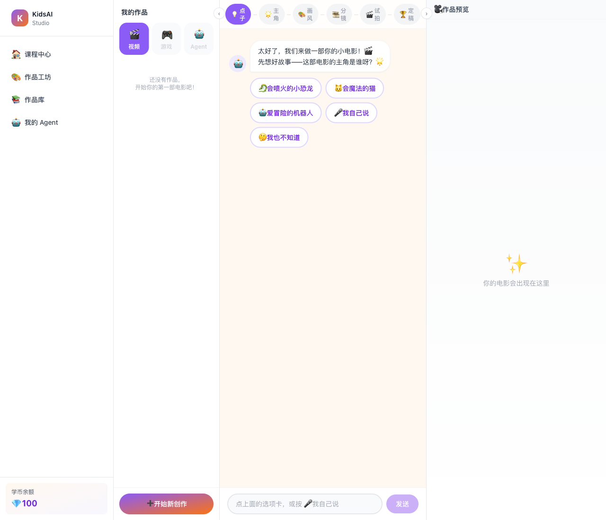

# KidsAI Studio · 种子用户指南

> 8-16 岁孩子的 AI 创作伙伴。本指南给种子用户和他们的家长 (lihao 微信群里的朋友) — 假设你从来没有用过 KidsAI, 看完这 3 屏应该能跑通。

---

## 第 1 屏 — 安装

**macOS (苹果电脑)**

1. 打开微信群里 lihao 发的 `KidsAI-0.1.0-aarch64.dmg` (M1/M2/M3/M4 Mac) 或 `KidsAI-0.1.0-x86_64.dmg` (Intel Mac)
2. 双击 .dmg → 把 KidsAI 图标拖到右边的 Applications 文件夹
3. 第一次打开时 macOS 会弹窗："无法验证开发者" → 打开「系统设置」→「隐私与安全性」→ 点「仍要打开」
4. 如果 KidsAI 闪退, 终端跑一次 `xattr -dr com.apple.quarantine /Applications/KidsAI.app` 即可

**Windows (Win10 / Win11)**

1. 打开微信群里的 `KidsAI-0.1.0-x86_64-setup.msi`
2. 双击 → 下一步 → 装完桌面上出现 KidsAI 图标
3. 第一次打开 SmartScreen 弹窗："Windows 已保护你的电脑" → 点「更多信息」→「仍要运行」

> ⚠️ **没有 Apple Developer / EV 代码签名**, 种子阶段先这样, 接受 Gatekeeper / SmartScreen 警告就好。
>
> ⚠️ **种子阶段暂只发 macOS .dmg** (3.0 MB). Windows .msi 需要在 Windows 机器上跑 `npm run tauri:build -- --target x86_64-pc-windows-msvc` 才能产; 想要 .msi 的朋友先微信群吼一声, lihao 在 Windows VM 上补.

---

## 第 2 屏 — 首次启动 + 激活

打开 KidsAI 看到一个欢迎页 (🦉 欢迎来到 KidsAI):

**操作:**
1. **填昵称** — 比如「小明」「可可」「阿泽」, 最多 16 个字
2. **选年级** — 三选一: 🐣 8-10 岁 / 🐥 11-13 岁 / 🦅 14-16 岁
3. 点「开始创作 🎨」

> 首次激活会自动从学币服务器拿到 100 学币 + 每天 30 学币的额度。学币是 KidsAI 内部积分, 不收钱, 用完找 lihao 加。

**激活后回到主页:**

主页上能看到:
- **顶部学币栏** (右上角) — 当前余额 + 今日剩余
- **反馈 🛎** — 有任何问题随时点, 弹二维码加 lihao 微信群
- **三个主菜单** — 🎮 游戏开发 / 🎬 视频创作 / 🤖 我的 Agent
- **7 个关卡 (L1 - L7)** — 当前解锁第 1 关, 玩过之后下一关解锁

---

## 第 3 屏 — 试试 Studio (3-pane 导演流)

点主页的「🎬 视频创作」卡片, 进入 3-pane Studio:

**界面分三块:**
- **左 — 我的作品** — 列出你做过的视频/游戏/Agent; 第一次是空的
- **中 — 6 阶导演流** — 一部小电影分 6 步走, AI 一路引导:
  1. 💡 **点子** — 你想做一部关于什么的电影?
  2. 🌟 **主角** — 主角是谁? (给选项 / 或「我自己说」)
  3. 🎨 **画风** — 皮克斯 / 日漫 / 水彩 / 写实…
  4. 🎞️ **分镜** — AI 自动把故事拆成 3-5 个镜头
  5. 🎬 **试拍** — 每个镜头先生成 5 秒试拍 (mini 模型, 9 学币)
  6. 🏆 **定稿** — 挑最满意的那个镜头, 用 2.0 模型生成最终版 (19 学币)
- **右 — 作品预览** — 生成出来的视频会出现在这里

**第 1 次试玩建议:**
- 主角选「🐉 会喷火的小恐龙」或「🐱 会魔法的猫」(AI 已经有预设, 出图效果最稳)
- 画风选「皮克斯」, 大多数题材都好看
- 试拍阶段看几个镜头效果, 挑最好的再花 19 学币定稿
- **定稿前一定让 AI 先试拍**, 否则 19 学币打水漂

**怎么省学币:**
- 学币每日 30 自动续, 不用攒
- 试拍用 mini 模型只花 9 学币, 别一开始就花 19 学币定稿
- 镜头不满意的可以「重新生成」, 每次 9 学币

---

## 第 4 屏 — 新能力: 录声音 / 配 BGM / 换引擎 (W6)

主角拍板后会出现 3 个新选项, 让作品更"专属":

- 🎤 **给主角录个声音** (10 学币/次) — 录 10 秒, 训练成主角的"专属配音", 后续每个镜头旁白都用这个声音读
- 🎵 **自动配 BGM** (8 学币/首) — 跟画风匹配的 30s 背景音乐, 定稿时自动加进视频
- 🎥 **换视频引擎** (12 学币/镜) — 默认走火山 Seedance 2.0; 可选 MiniMax hailuo-02 (备用, 仅当 Seedance 出问题时手动切)

**怎么用:**
1. 阶段2 主角拍板后, 顶部会出现「🎤 录声音」按钮
2. 阶段5 试拍前, 顶部会出现「🎥 选引擎」按钮
3. 阶段6 定稿时, BGM 自动配; 不想要可在「作品预览」里关掉

**消耗看板:** 主页右上角能看到今天已用多少学币 (按类型分: 视频 / 图像 / 声音 / 音乐).

---

## 遇到问题?

- **学币不够?** → 微信群里 @ lihao 加学币 (lihao 后台有个 admin 工具, 几秒钟就到账)
- **视频生成失败?** → 试拍阶段是「最多重试 2 次」, 还失败就把 prompt 改简单点 (比如 "一只小猫追蝴蝶" 比 "一只橙色的虎斑小猫在月光下追一只蓝色的蝴蝶" 出图更稳)
- **激活时连不上服务器?** → 检查网络; 还不行就重启 KidsAI
- **崩溃 / 错误弹窗?** → 点右上角「🛎 反馈」告诉 lihao, 把错误截图发群里
  - 想看运行日志, macOS 路径 `~/Library/Application Support/ai.kidsai.studio/logs/kidsai-YYYY-MM-DD.log`, Windows 路径 `%APPDATA%\ai.kidsai.studio\logs\kidsai-YYYY-MM-DD.log`

---

## 下一步

- **关卡 L1-L7** — 主页上有 7 关, 一关一关玩过去, 学会 AI 怎么帮你创作
- **作品库** — 点侧栏「📚 作品库」看你所有作品
- **我的 Agent** — 打造专属 AI 助手 (关卡 L7 解锁后)

> 种子阶段遇到任何问题, 直接微信群吼一声, lihao 当天回复。